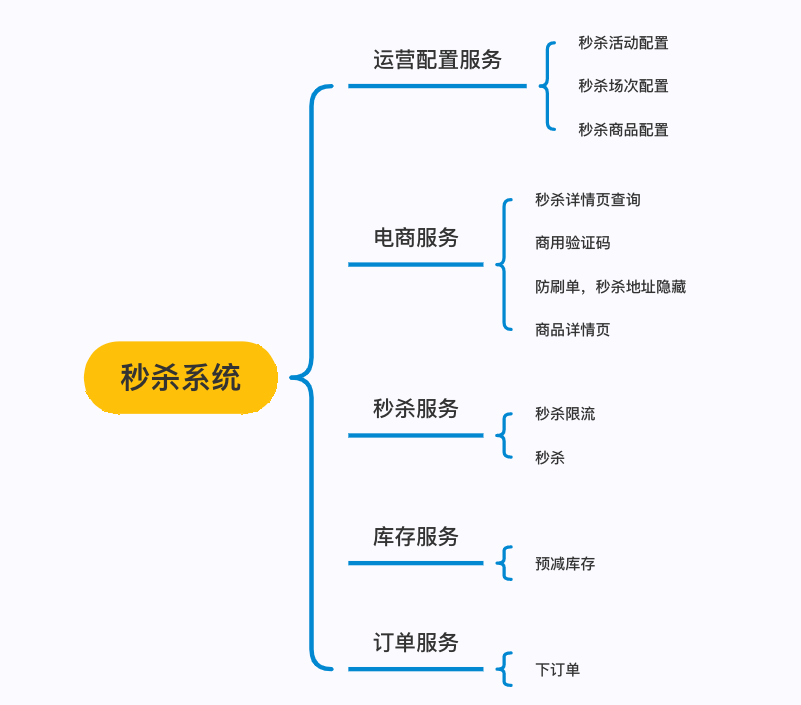

# 秒杀系统
## 技术架构
### 技术选型

>  开发框架  `springboot` + `springmvc` + `mybatis` + `spock`（单测框架）
 
>  中间件   `redis` + `kafka` + `mysql`

>  `TDD` 基于测试驱动开发模式编写代码，所有代码基于spock来做测试

### 业务架构

### 功能拆解脑图

### 知识点概述
> 1. 整合spock 单元测试框架  [spock官网](https://spockframework.org/spock/docs/2.0/index.html)
   很多人没有写单测的习惯，这如同上厕所不洗手，[单测文章推荐](https://tech.meituan.com/2021/08/06/spock-practice-in-meituan.html)
> 2. 全局异常处理，全局结果统一处理 [参考文档](https://mp.weixin.qq.com/s/XoegShXQwsblNy48t6QHFA)
todo： 持续维护中。。。

### tips
代码风格： 不再是传统的三层架构，基于DDD的四层架构来进行分层，同时代码抛弃贫血模型，基于充血模型

